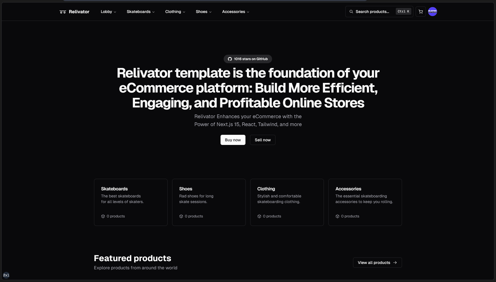

# Relivator Next.js Template

Please consider following this project's author, [Nazar Kornienko](https://github.com/), and consider starring the project to show your ❤️ and support.

- **🚀 Live Demo**: [relivator.com](https://relivator.com/en)
- **💙 Discord**: [discord.gg/Pb8uKbwpsJ](https://discord.gg/Pb8uKbwpsJ)
- **📚 Docs**: [docs.relivator.org](https://docs.relivator.org/relivator)

## How to Run or Build the Project?

Make sure you have [Git](https://git-scm.com/downloads), [Node.js](https://nodejs.org/en), and [Bun](https://bun.sh) installed. Then:

1. `git clone https://github.com/blefnk/relivator.git`
2. `cd relivator`
3. `bun i`
4. `cp .env.example .env` → Fill in the .env file
5. `bun db:push`
6. `bun dev` / `bun run build`

## What is Relivator?

The Relivator Next.js template serves as the foundation for your eCommerce platform, helping you create efficient, engaging, and profitable online stores. Relivator enhances any eCommerce with the power of modern Next.js, React, TypeScript, Tailwind, and more. For detailed information about the Relivator template and its bootstrapper, [Relivator](https://github.com/relivator/cli), you can visit the [documentation website](https://docs.relivator.org/relivator).

## Stack of technologies

- **Core**: Next.js 15.1, React 19, TypeScript 5.7
- **Internationalization**: next-intl
- **Styling**: Tailwind & Shadcn/UI
- **Auth**: Clerk
- **Payments**: Stripe
- **Database**: Drizzle ORM & Neon Postgres
- **File Storage**: Uploadthing
- **Tools**: ESLint 9, Biome, Knip

## What if I want to have another stack?

1. `bun i -g @reliverse/cli@latest`
2. `reliverse`
3. Select _Build a brand new thing from scratch_
4. Provide details about your new project
5. Select the technologies you want to use
6. No more steps! It's ready! 😊🎉
